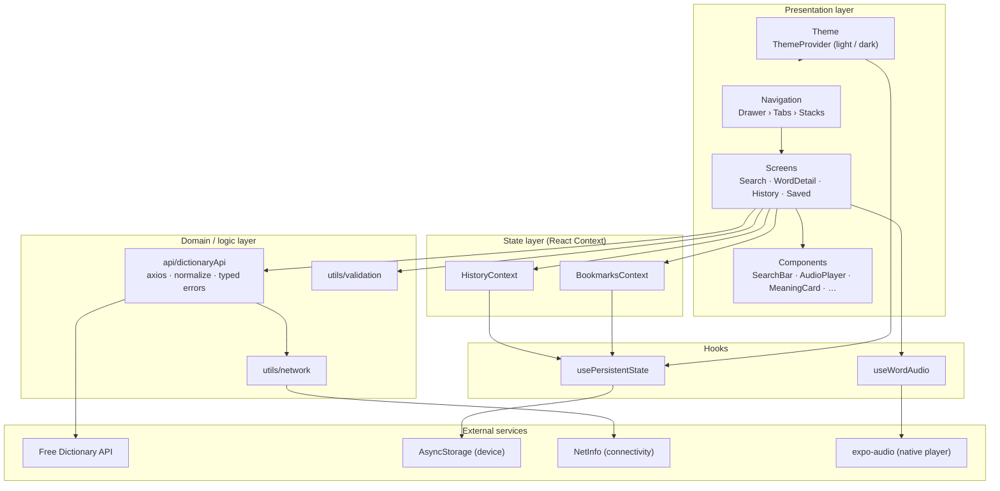
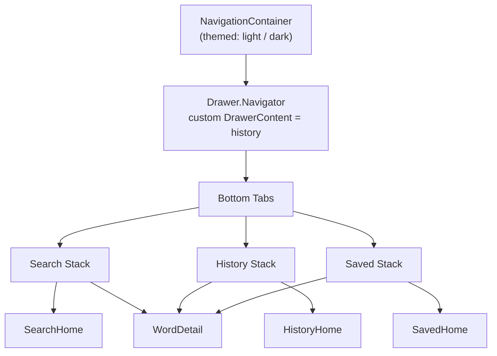
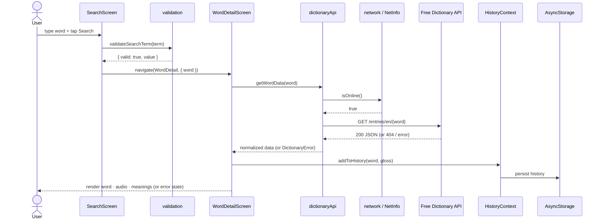
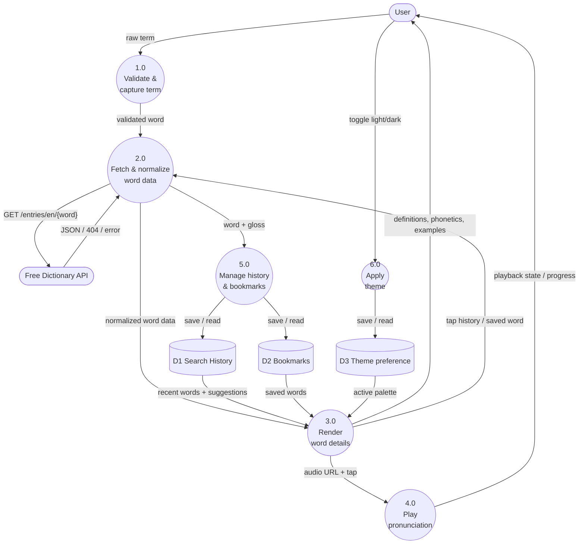
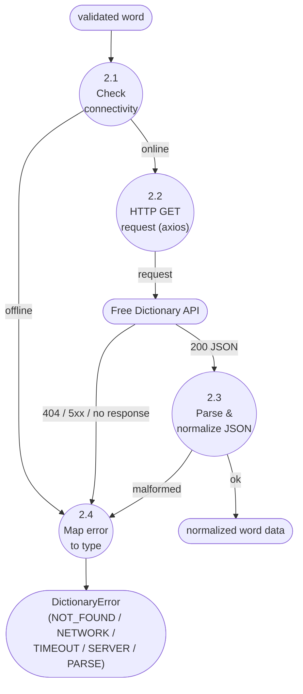

# LexiTech — System Architecture & Data Flow

Design deliverable for the Dictionary Mobile App: the **system architecture**
(layered view, runtime navigation, search sequence) and the **data flow
diagrams** (Level 0 context, Level 1, and a Level 2 detail of the search
process). Diagrams use Mermaid and render on GitHub / VS Code.

---

## 1. System Architecture

### 1.1 Layered architecture

The app is a layered client: **Presentation → State → Hooks → Domain/Logic →
External services**. Each layer only depends on the layer beneath it.

### 1.2 Module responsibilities

| Layer          | Module(s)                                              | Responsibility                                            |
| -------------- | ------------------------------------------------------ | --------------------------------------------------------- |
| Presentation   | `navigation/`, `screens/`, `components/`               | Render UI, capture input, route between screens           |
| Presentation   | `theme/` (`ThemeProvider`, `useTheme`)                 | Light/dark tokens; re-themes the whole tree               |
| State          | `context/HistoryContext`, `BookmarksContext`           | App-wide history & bookmarks (deduped, persisted)         |
| Hooks          | `hooks/useWordAudio`                                   | Pronunciation transport + progress over `expo-audio`      |
| Hooks          | `hooks/usePersistentState`                             | AsyncStorage-backed state (hydration-safe)                |
| Domain / logic | `api/dictionaryApi`                                    | Build request, call API, normalize JSON, map typed errors |
| Domain / logic | `utils/validation`                                     | Validate the search term (single word, letters)           |
| Domain / logic | `utils/network`                                        | Proactive connectivity check                              |
| External       | Free Dictionary API, AsyncStorage, NetInfo, expo-audio | Network data, persistence, connectivity, audio            |

### 1.3 Runtime / navigation structure

`WordDetail` is registered in **every** tab's stack, so the bottom bar stays
visible on the detail screen and every entry point reuses one screen.

### 1.4 Tech stack

React Native (Expo SDK 56) · React Navigation (Drawer + Bottom Tabs + Native
Stack) · **axios** · `expo-audio` · `@react-native-community/netinfo` ·
`@react-native-async-storage/async-storage` · `@expo/vector-icons` (Ionicons) ·
React Context for state · Expo CLI for dev/testing.

### 1.5 Search sequence (control + data)

---

## 2. Data Flow Diagrams

**Legend:** `()` rounded = external entity · `(())` circle = process ·
`[( )]` cylinder = data store.

### 2.1 Level 0 — context diagram

### 2.2 Level 1 — processes & data stores

### 2.3 Level 2 — process 2.0 "Fetch & normalize word data"

---

## 3. Data stores

| Store | Key                    | Shape                             | Persistence  |
| ----- | ---------------------- | --------------------------------- | ------------ |
| D1    | `@lexitech/history`    | `[{ word, gloss, partOfSpeech }]` | AsyncStorage |
| D2    | `@lexitech/bookmarks`  | `[{ word, gloss, partOfSpeech }]` | AsyncStorage |
| D3    | `@lexitech/theme-mode` | `"light"` \| `"dark"`             | AsyncStorage |

## 4. API / endpoint

| Method | Endpoint                                                 | Purpose        |
| ------ | -------------------------------------------------------- | -------------- |
| GET    | `https://api.dictionaryapi.dev/api/v2/entries/en/{word}` | Look up a word |

Handled responses: `200` (array of entries), `404` (not found), offline,
timeout, server (`5xx`), and malformed payloads — each mapped to a typed
`DictionaryError` and rendered as a friendly state with retry.
