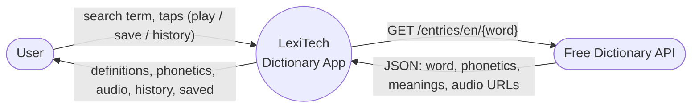
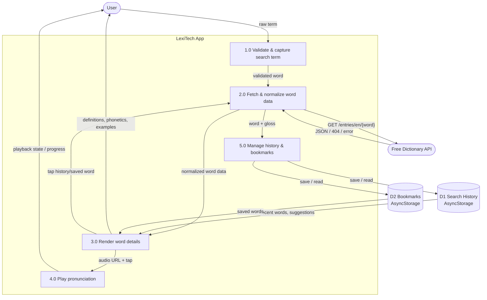

# LexiTech — Design Document

This is the "first-hour" design deliverable: data-flow diagrams, application
architecture, the API endpoint consumed, the pages developed, and the data
stores used.

---

## 1. Data Flow Diagram

### 1.1 Context diagram (Level 0)

The system has two external entities — the **User** and the **Free Dictionary
API** — and one process (the app).



### 1.2 Level 1 DFD

Processes (1.0–5.0) and data stores (D1, D2). Search history and bookmarks are
persisted locally via AsyncStorage.



**Error & validation flows** (part of 1.0 / 2.0): empty or non-letter input is
rejected at 1.0 before any request; 2.0 maps `404`, offline, timeout, server,
and malformed responses to typed errors that 3.0 renders as friendly states
with a retry action.

---

## 2. Architecture

```
App.js
  GestureHandlerRootView › SafeAreaProvider › HistoryProvider › BookmarksProvider
        │
   AppNavigator
   └── Drawer.Navigator (custom DrawerContent = history)
         └── Bottom Tabs (Search · History · Saved)
               ├── Search  ─ Stack( SearchHome → WordDetail )
               ├── History ─ Stack( HistoryHome → WordDetail )
               └── Saved   ─ Stack( SavedHome → WordDetail )
```

| Layer        | Responsibility                                                       |
| ------------ | -------------------------------------------------------------------- |
| `api/`       | axios client + JSON normalization (`getWordData`), typed errors      |
| `utils/`     | input validation, connectivity check                                 |
| `context/`   | search history + bookmarks (deduped, persisted)                      |
| `hooks/`     | `useWordAudio` (transport + progress), `usePersistentState`          |
| `screens/`   | orchestration (loading / error / success)                            |
| `components/`| presentational UI (cards, player, list rows, icons)                  |
| `theme/`     | design tokens                                                        |

The **WordDetail** screen owns the fetch, so every entry point (search, history,
saved, drawer, suggestions) reuses one loading/error/retry path.

---

## 3. API / endpoints

The app is a client of one public endpoint (no custom backend is required).

| Method | Endpoint                                                  | Purpose        |
| ------ | -------------------------------------------------------- | -------------- |
| GET    | `https://api.dictionaryapi.dev/api/v2/entries/en/{word}` | Look up a word |

Responses handled: `200` (array of entries), `404` (not found), offline,
timeout, server (`5xx`), and malformed payloads.

---

## 4. Pages / screens

| Page            | Activity   | Purpose                                                     |
| --------------- | ---------- | ---------------------------------------------------------- |
| Search (home)   | 1, 5       | Validated input + history-backed suggestions                |
| Word Detail     | 1, 2, 3, 5 | Word, phonetics, meanings, examples, synonyms, audio player |
| History (tab)   | 4          | Past searches with descriptions; re-open / remove / clear   |
| Saved (tab)     | —          | Bookmarked words with descriptions                          |
| Drawer          | 4          | Brand + search history + clear                              |

---

## 5. Data stores

| Store | Key                    | Shape                                   | Persistence  |
| ----- | ---------------------- | --------------------------------------- | ------------ |
| D1    | `@lexitech/history`    | `[{ word, gloss, partOfSpeech }]`       | AsyncStorage |
| D2    | `@lexitech/bookmarks`  | `[{ word, gloss, partOfSpeech }]`       | AsyncStorage |

---

## 6. Notes

- **Loading feedback**: pressing Search navigates immediately to Word Detail,
  which shows the loading indicator while the request is in progress.
- **Cross-platform**: no platform-specific native code; verified on Android
  (Expo Go). iOS uses the same JS and is expected to behave identically.
- **Auth**: intentionally deferred — no required feature needs an account.
